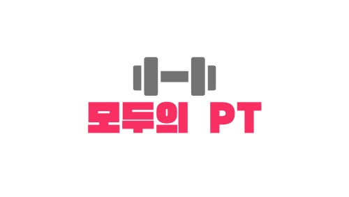

# 모두의 PT

<div align='center'>
  <!-- logo -->
  
</div>

## Contents
- [Description](#description)  
- [Links](#links)  
- [Preview](#preview)  
- [Features](#features)  
- [Install](#install)  
- [Skills](#skills)  

<br>

## Description
'모두의 PT'는 운동 콘텐츠를 위한 영상 기반 커뮤니티 웹사이트입니다.  
회원제로 운영되며 회원가입 후 리뷰 남기기, 영상 찜, 시청기록 등의 서비스를 이용할 수 있습니다.

<br>

## Links
### Github Repositories
- Client: https://github.com/wet6123/ssafit_team_13
- Server: https://github.com/CastleSilver/SSAFIT

<br>

## Preview

<div align='center'>
  <!-- preview -->
  
</div>

<br>

## Features
- 메인 화면  

  - 메인 화면에는 시청 기록을 기반으로 사용자가 관심있을만한 영상을 추천해 줍니다. 썸네일 이미지를 누르면 메인 화면에서 영상을 미리볼 수 있습니다.  
  - 추천 영상 아래에는 부위별 카테고리로 영상을 찾아볼 수 있는 버튼들이 있습니다. 버튼을 누르면 해당 카테고리의 영상이 정렬 됩니다.  

  - 영상 목록의 썸네일에 마우스를 올리면 제목과 함께 찜버튼이 나타납니다. 썸네일을 클릭하면 영상을 감상할 수 있고 리뷰를 남길 수 있는 영상 세부 화면으로 이동합니다. 영상 목록은 무한 스크롤이 구현되어 영상의 양이 방대해도 부담 없이 감상할 수 있습니다.
  
- 검색 메뉴    

  - 검색 메뉴에서는 검색어를 입력하면 실시간으로 영상 제목으로 영상을 검색할 수 있습니다.
  
- 회원가입과 로그인  

  - 회원 가입 시에는 아이디 중복 체크, 이메일 중복 체크, 비밀번호 확인을 진행합니다. 
  - JWT토큰을 활용하여 로그인 시 보안을 강화했습니다.
  
<br>

<hr>

### $$$$$$ 작성중 $$$$$$

<hr>

## Install


<br>

## Skills

<br>

## Project setup
```
npm install
```

### Compiles and hot-reloads for development
```
npm run serve
```

### Compiles and minifies for production
```
npm run build
```

### Lints and fixes files
```
npm run lint
```

### Customize configuration
See [Configuration Reference](https://cli.vuejs.org/config/).
